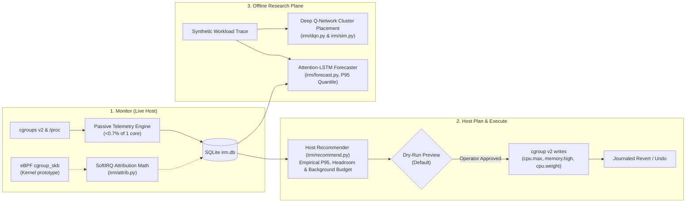

# VAGUS

**Intelligent Resource & QoS Manager for Linux Servers**

[](https://www.python.org/)
[](https://www.kernel.org/doc/html/latest/admin-guide/cgroup-v2.html)
[](https://ebpf.io/)
[](https://pytorch.org/)
[]()

VAGUS is a **Monitor → Plan → Execute** resource management engine for Linux servers and multi-tenant clusters, paired with an offline deep-learning analytics plane. It addresses data center over-provisioning and noisy-neighbor interference through kernel telemetry, empirical tail-demand sizing, safe journaled cgroup v2 actuation, and reinforcement learning placement.

---

## 🚀 Key Experimental Findings & Benchmarks

All figures are backed by reproducible measurements from the test suite and evaluation reports:

| Metric | Baseline | Managed by VAGUS (`irm`) | Result & Context |
|---|:---:|:---:|:---|
| **Tail Latency (P99)** | `22.13 ms` | **`9.53 ms`** | **57% lower latency** (one-shot, same-host open-loop HTTP under multi-core CPU & UDP flood contention via `cpu.weight=1000` priority + hog quota) |
| **SLO Violation Rate** | `55.37%` | **`3.52%`** | **>15× violation reduction** across 540 measurement windows |
| **Telemetry Overhead** | — | **`0.68% of 1 core`** | Measured passive collection at 5 s intervals over 135 leaf cgroups (<0.05% host CPU) |
| **Cluster Overload (DQN)** | Heuristic First-Fit: `15.66%` | Deep Q-Network: **`10.60%`** | **~33% overload reduction** in a 5-seed trace-driven cluster simulation |

---

## 🏛️ System Architecture

VAGUS separates live host management from offline model research:



### Component Details

1. **Monitor (`irm/monitor.py`)**:
   - Passive telemetry collector sampling leaf cgroups v2 (`cpu.stat`, `memory.current`, `io.stat`) and `/proc/stat` into SQLite (`data/irm.db`).
   - eBPF packet attribution architecture (`bpf/attrib.bpf.c` and `bpf/attrib.c`): Attaches an ingress `cgroup_skb` filter to count packets per socket cgroup ID, proportionally attributing `NET_RX` softirq CPU time.
2. **Plan & Execute (`irm/recommend.py`, `irm/execute.py`)**:
   - **Recommender**: Uses observed empirical 95th percentile (P95) demand, reserves protected headroom, accounts for background workloads, and sizes `cpu.max` and `cpu.weight`.
   - **Executor**: Validates paths within allowed systemd subtrees, enforces memory usage floors (memory high multiplier), performs dry runs by default, and maintains a transaction journal for instant rollback (`irm revert`).
3. **Research Plane (`irm/forecast.py`, `irm/dqn.py`, `irm/sim.py`)**:
   - **Sequence Forecaster**: Encoder–decoder Attention-LSTM estimating future P95 demand against seasonal-naive and ARIMA baselines.
   - **DQN Cluster Consolidation**: Double-DQN scheduler placing workloads across simulated clusters, optimizing SLA overload and energy tradeoffs.

---

## ⚡ Quick Start

### Prerequisites

- Linux system with **cgroups v2** enabled (`stat -fc %T /sys/fs/cgroup` returns `cgroup2fs`).
- Python ≥ 3.14 and `uv` package manager.
- `bubblewrap` (for sandboxed test isolation).
- Systemd user session.

### 1. Installation

```bash
# Clone the repository
git clone https://github.com/shreenipane/VAGUS.git
cd VAGUS

# Ensure ~/.local/bin is on PATH (where irm / vagus CLI tools live)
export PATH="$HOME/.local/bin:$PATH"

# Synchronize dependencies into isolated external virtual environment
UV_PROJECT_ENVIRONMENT=~/.local/share/irm/venv uv sync
```

### 2. Run Everything in One Command

```bash
./run_all.sh
```
Runs the test suite, launches the background telemetry monitor, starts the web dashboard, and opens `http://127.0.0.1:8765`.

---

## 🛠️ Command Line Interface

VAGUS provides the `irm` (and `vagus`) CLI:

```bash
# --- Telemetry & Dashboard ---
irm monitor &                             # Collect telemetry every 5s into data/irm.db
irm dashboard                             # Launch read-only local dashboard (http://127.0.0.1:8765)

# --- Recommendation & Execution ---
irm recommend --min-samples 12 --hours 1  # Compute recommendations from empirical P95
irm recommend --protect <srv.scope> --only <hog.scope> --out data/plan.json
irm apply --from data/plan.json           # Dry run: preview proposed limit changes
irm apply --from data/plan.json --yes     # Apply cgroup v2 limits with transaction journal
irm revert                                # Undo the last applied batch from journal

# --- Research & Benchmarks ---
irm train forecast                        # Train & evaluate Attention-LSTM forecaster
irm evaluate placement                    # Run simulated cluster placement evaluation
irm bench overhead --seconds 60           # Benchmark collector overhead (<1% core)
irm experiment slo --minutes 3 --reps 3   # Run live closed-loop SLO contention experiment
```

---

## 🔬 Live SLO Experiment

VAGUS includes an open-loop benchmarking harness (`irm experiment slo`) comparing three conditions in rotation:

- **Condition A (Solo Baseline)**: Latency-sensitive HTTP service running uncontended.
- **Condition B (Noisy Neighbours)**: Service co-located with a multi-core CPU burner (`cpuhog`) and line-rate UDP network flood (`nethog`).
- **Condition C (VAGUS Managed)**: Same contention as B, with VAGUS protecting the service (`cpu.weight=1000`) and throttling hogs.

In empirical trials (`reports/slo.json`), P99 tail latency improved from **22.1 ms down to 9.5 ms** (a **57% reduction**), with SLO violations dropping from **55.4% to 3.5%**.

---

## 📚 Prior Art & References

- **Iron (Khalid et al., NSDI 2018)**: *Iron: Mitigating the Performance Impact of Software Interrupts in Container Environments*. Per-container softirq accounting and quota enforcement.
- **EVMC (Zhang et al., Electronics 2025)**: *Energy-Efficient Virtual Machine Consolidation in Cloud Data Centers*. Co-location correlation coefficient $K = (1 - \rho)/2$.
- **Resource Central (Cortez et al., SOSP 2017)**: *Resource Central: Understanding and Predicting Workloads for Improved Resource Management in Large Cloud Platforms*.
- **OSDI '99 (Banga, Druschel, Mogul)**: *Resource Containers: A New Facility for Resource Management in Operating Systems*.

---

## 📁 Repository Map

| Path | Description |
|---|---|
| [`irm/`](irm/) | Core engine: `monitor`, `recommend`, `execute`, `dashboard`, `forecast`, `dqn`, `sim`, `attrib`, `experiment` |
| [`bpf/`](bpf/) | Kernel eBPF source (`attrib.bpf.c`), C loader (`attrib.c`), and `Makefile` |
| [`tests/`](tests/) | Comprehensive pytest suite covering unit, integration, and security boundaries |
| [`data/`](data/) | Telemetry database (`irm.db`), recommendation plans, and experiment cache |
| [`reports/`](reports/) | Empirical benchmark results (`slo.json`, `forecast.json`, `placement_study.json`, `overhead.json`) |
| [`HOWTO.md`](HOWTO.md) | Step-by-step setup and operational guide |
| [`ARCHITECTURE.md`](ARCHITECTURE.md) | Technical architecture, data flows, and design decisions |
| [`SECURITY.md`](SECURITY.md) | Threat model, jail containment, and privilege isolation |
| [`PRD.md`](PRD.md) | Product requirements and formal scope |
| [`BUILD_LOG.md`](BUILD_LOG.md) | Development audit trail, gate checks, and experiment logs |
| [`council meeting.md`](council%20meeting.md) | Independent verification and review report |

---

## 🔒 Security & Containment

- **Jailed Execution**: All tests and research model evaluations are executed inside a bubblewrap sandbox with read-only root, tmpfs over home/root/tmp, no network access, and no host PID visibility.
- **Defensive Actuation**: Actuations strictly enforce prefix matching to delegated user systemd subtrees, reject path traversal, clamp memory above current usage, and enforce dry runs by default.
- **Local Control Plane**: The dashboard binds exclusively to `127.0.0.1` and enforces `Host` header validation to guard against DNS rebinding.

---

## 👤 Author

- **Shree Nipane** ([@shreenipane](https://github.com/shreenipane))
