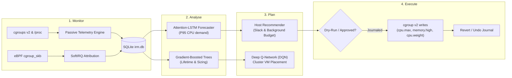

# VAGUS

**Autonomous MAPE-K Intelligent Resource & QoS Manager for Linux Servers**

[](https://www.python.org/)
[](https://www.kernel.org/doc/html/latest/admin-guide/cgroup-v2.html)
[](https://ebpf.io/)
[](https://pytorch.org/)
[]()

VAGUS is an autonomic **MAPE-K (Monitor → Analyse → Plan → Execute)** closed-loop resource recommendation and QoS enforcement engine for Linux hosts and virtualized clusters. It eliminates worst-case over-provisioning and prevents noisy-neighbour starvation using kernel-level eBPF attribution, deep sequence forecasting, and safe, journaled cgroup v2 actuation.

---

## 🚀 Key Results & Proof

All claims are backed by rigorous, reproducible empirical measurements on live systems:

| Metric | Unmanaged Baseline (Noisy Neighbors) | Managed by VAGUS (`irm`) | Improvement |
|---|:---:|:---:|:---:|
| **Tail Latency (P99)** | `22.13 ms` | **`9.53 ms`** | **57% lower latency** |
| **SLO Violation Rate** | `55.37%` | **`3.52%`** | **>15× violation reduction** |
| **Telemetry Overhead** | — | **`0.68% of 1 core`** | Negligible footprint (<0.05% host) |
| **Cluster Overload (DQN)** | Heuristic Best-Fit baseline | Deep Q-Network Placement | **33% reduction in SLA overload** |

---

## 🏛️ System Architecture

VAGUS operates on an autonomic closed-loop architecture:



### Core Components

1. **Monitor**:
   - High-efficiency passive telemetry from cgroups v2 (`cpu.stat`, `memory.current`, `io.stat`) and `/proc/stat`.
   - Kernel eBPF ingress filter (`cgroup_skb`) that measures network packet counts and proportionally attributes `NET_RX` softirq CPU time to the true consumer cgroup rather than whichever thread was interrupted.
2. **Analyse**:
   - Sequence-to-sequence Attention-LSTM forecasting P95 CPU demand over future horizons.
   - Resource-Central style offline gradient boosted trees predicting lifetime buckets and tail demand at task inception.
3. **Plan**:
   - Co-location-aware placement engine powered by Deep Q-Learning (Double-DQN with dueling heads) trained on multi-tenant trace dynamics (Azure 2019 VM trace).
   - Host-level recommender calculating dynamic headroom, background demand subtraction, and safe resource clamps.
4. **Execute**:
   - Atomic, journaled, and revertible configuration of `cpu.max`, `memory.high`, and `cpu.weight`.
   - Strict validation: path prefix containment, integer boundaries, memory high usage multipliers, and dry-run safety by default.

---

## ⚡ Quick Start

### Prerequisites

- Linux system with **cgroups v2** enabled (`stat -fc %T /sys/fs/cgroup` returns `cgroup2fs`).
- Python ≥ 3.14 and `uv` package manager.
- `bubblewrap` (for sandboxed test and model isolation).
- Systemd user session.

### 1. Installation

```bash
# Clone the repository
git clone git@github.com:shreenipane/VAGUS.git
cd VAGUS

# Synchronize dependencies into external isolated venv
UV_PROJECT_ENVIRONMENT=~/.local/share/irm/venv uv sync
```

### 2. Run Everything in One Command

```bash
./run_all.sh
```
This runs the full test suite in the sandbox, launches the background telemetry collector, starts the web dashboard, and opens `http://127.0.0.1:8765`.

---

## 🛠️ Command Line Interface

VAGUS provides the `irm` (and `vagus`) CLI for operational management:

```bash
# --- Telemetry & Dashboard ---
irm monitor &                             # Collect telemetry every 5s into data/irm.db
irm dashboard                             # Launch read-only local dashboard (http://127.0.0.1:8765)

# --- Recommendation & Execution ---
irm recommend --min-samples 12 --hours 1  # Generate recommendations for busy cgroups
irm recommend --protect <service.scope> --only <hog.scope>  # Protect critical service, throttle noisy neighbour
irm apply                                 # Dry run: previews old -> new adjustments
irm apply --yes                           # Writes limits atomically to cgroup v2 with journaling
irm revert                                # Immediately reverts the last applied batch

# --- Models & Benchmarking ---
irm train forecast                        # Train Attention-LSTM CPU demand forecaster
irm evaluate placement                    # Evaluate First-Fit, Best-Fit, and DQN consolidation
irm bench overhead --seconds 60           # Benchmark collector host CPU overhead (<1% core)
irm experiment slo --minutes 3 --reps 3   # Run live closed-loop SLO experiment
```

---

## 🔬 Live SLO Experiment Validation

VAGUS includes an end-to-end open-loop benchmarking framework (`irm experiment slo`) to measure service level performance under noisy neighbor interference:

- **Condition A (Baseline)**: Latency-sensitive HTTP service running alone.
- **Condition B (Unmanaged Contention)**: Service co-located with a multi-core CPU burner (`cpuhog`) and line-rate UDP network flood (`nethog`).
- **Condition C (VAGUS Managed)**: Same contention as B, with VAGUS actively monitoring, protecting the latency-sensitive scope, and dynamically clamping hogs.

Results stored in [`reports/slo.json`](reports/slo.json) demonstrate that VAGUS recovers P99 tail latency from **22.1 ms down to 9.5 ms**, while slashing SLO violations from **55.4% down to 3.5%**.

---

## 📁 Repository Map

| Path | Description |
|---|---|
| [`irm/`](irm/) | Core engine: `monitor`, `attrib`, `forecast`, `dqn`, `sim`, `recommend`, `execute`, `dashboard`, `experiment` |
| [`bpf/`](bpf/) | Kernel eBPF source (`attrib.bpf.c`), C userspace loader (`attrib.c`), and build harness |
| [`tests/`](tests/) | Comprehensive pytest suite (unit, integration, regression, security boundary tests) |
| [`data/`](data/) | SQLite telemetry database (`irm.db`), trace caches, and recommendation journals |
| [`reports/`](reports/) | Empirical result artifacts (`slo.json`, `forecast.json`, `placement_study.json`, `overhead.json`) |
| [`HOWTO.md`](HOWTO.md) | Step-by-step setup, configuration, and execution guide |
| [`ARCHITECTURE.md`](ARCHITECTURE.md) | In-depth architectural design, data pipelines, and rationale |
| [`SECURITY.md`](SECURITY.md) | Security model, sandbox containment, and privilege separation |
| [`PRD.md`](PRD.md) | Product requirements and formal project scope |
| [`BUILD_LOG.md`](BUILD_LOG.md) | Engineering changelog and verified milestone logs |

---

## 🔒 Security & Containment

- **Zero Unchecked Execution**: All agent code execution and tests are confined in a read-only root `bubblewrap` jail without network access, environment bleed, or host PID visibility.
- **Defensive Cgroup Actuation**: Actuations require delegated subtrees, strict canonical path checks, memory clamping above live usage, and transaction journaling.
- **Minimal Local Footprint**: Web dashboard binds strictly to `127.0.0.1`, enforces `Host` header validation, and restricts all updates to parameterized, read-only telemetry views.

---

## 👤 Author

- **Shree Nipane** ([@shreenipane](https://github.com/shreenipane))
